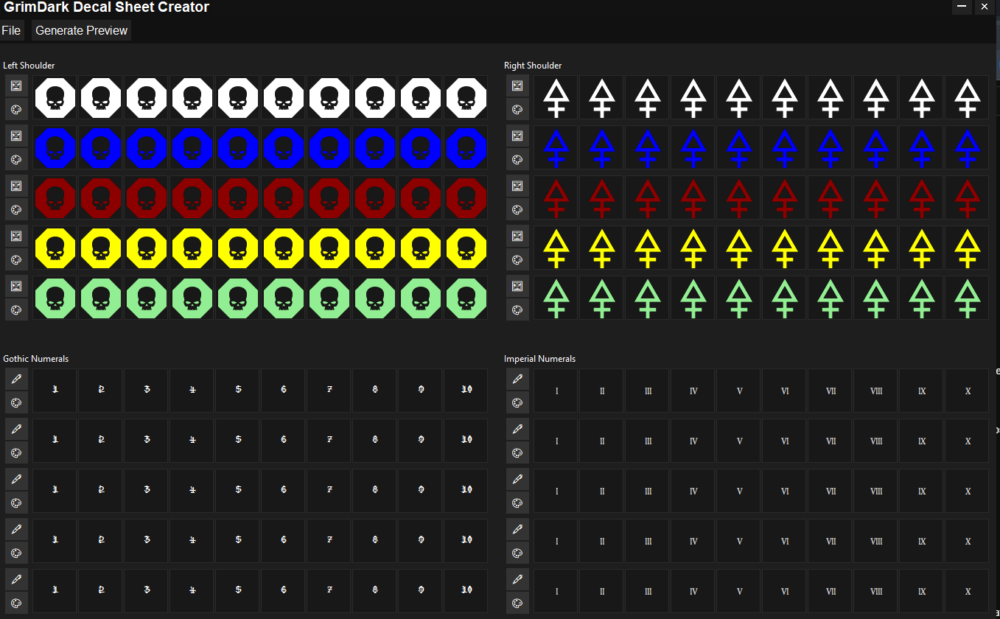

# 🛡️ GrimDark Decal Sheet Generator

GrimDark Decal Sheet Generator - Alpha 0.0

This is a custom toolkit for crafting printable A5 decal sheets featuring icons, insignias, and unit markings for your miniature gaming insignia requirements, be it space buddies or chonky tonks. Designed with flexibility, customization, and fun in mind — and just a little bit of hearsay.



---

## ⚙ Features

- 🖼️ **SVG Icon Grid** — Supports row and section customization, print different ranks or iconography in a single file.
- 🎨 **Color Tinting** — Apply unique colors to each icon or font row.
- 🔠 **Font Support** — Choose from embedded gothic and classic typefaces, or include your own!
- 📄 **High-Fidelity PDF Export** — Lossless, printer-ready A5 landscape layout.
- 🧪 **Debug Preview** — See exactly what you'll print with full transparency support.
- 🐱 **Cat-assisted coding** — Thanks to Morgana for QA purr-formance.

---

## 📥 Installation

```bash
git clone https://github.com/tryadelion/grimdark-decal-sheet-generator.git
cd grimdark-decal-sheet-generator
python app_v2.py
```

install all the things on the import. I'll get a requirements.txt running at one point.

Python 3.11+ is recommended.

---

## 🖨️ Printing

- Export your layout using the **Preview > Send to Print** option.
- All icons are rendered as tinted SVGs for maximum clarity.
- Output is scaled to fit A5 landscape, ideal for decal paper sheets.

---

## 📦 Resources & Credits

This tool was developed by **Eric Cugota** ([@tryadelion](https://github.com/tryadelion))  
with inspiration and resources from the **Bolter and Chainsword** community and the worlds built by GW.

### Fonts
- **Caliban Angelus** — Creator unknown, stylized gothic.
- **Caslon Antique** — By Berne Nadall, 1894.

### Icons
- From the **Grimworld 40K icon library** by **Bishop Greisyn** and **Abomination**.

🐾 Special thanks to **Morgana the cat** for providing moral support and hair on the keyboard.

---

## 🧪 Development

Feel free to fork, tinker, or open an issue!  
Major components:
- `app_v2.py` — Main Tkinter application. V1 was the prototype, some things should still work there.
- `icon_parsing.py` — Handles tag parsing and icon object management.
- `/icons/` — Your icon library in SVG format. follow the tag naming convention for nice ordering.
- `/fonts/` — Drop `.ttf` files here to use them in the app.

---

## 📜 License

This project is licensed under the MIT License.

> No ownership is claimed over included resources, attributions are credited above.  
> This is a open source, free fan-made tool. It is not affiliated with or endorsed by any company.

---

## 🌌 Roadmap

- [✅] Base layout
- [✅] Importing and listing of fonts
- [✅] importing and listing of icons
- [✅] font and icon tinting
- [✅] Preview generation
- [🔄] make printing as PDF work
- [ ] Add export layout save/load feature
- [ ] Expand icon/tag filtering
- [ ] Combined SVG + font for platoon marks
- [ ] suggestions accepted....

---

## 💬 Feedback & Contributions

Suggestions, bug reports, and PRs welcome.  
Drop a message or open an issue!

---

Copyright (c) 2025 Eric Cugota

Permission is hereby granted, free of charge, to any person obtaining a copy of this software and associated documentation files (the "Software"), to deal in the Software without restriction, including without limitation the rights to use, copy, modify, merge, publish, distribute, sublicense, and/or sell copies of the Software, and to permit persons to whom the Software is furnished to do so, subject to the following conditions:

The above copyright notice and this permission notice shall be included in all copies or substantial portions of the Software.

THE SOFTWARE IS PROVIDED "AS IS", WITHOUT WARRANTY OF ANY KIND, EXPRESS OR IMPLIED, INCLUDING BUT NOT LIMITED TO THE WARRANTIES OF MERCHANTABILITY, FITNESS FOR A PARTICULAR PURPOSE AND NONINFRINGEMENT. IN NO EVENT SHALL THE AUTHORS OR COPYRIGHT HOLDERS BE LIABLE FOR ANY CLAIM, DAMAGES OR OTHER LIABILITY, WHETHER IN AN ACTION OF CONTRACT, TORT OR OTHERWISE, ARISING FROM, OUT OF OR IN CONNECTION WITH THE SOFTWARE OR THE USE OR OTHER DEALINGS IN THE SOFTWARE.